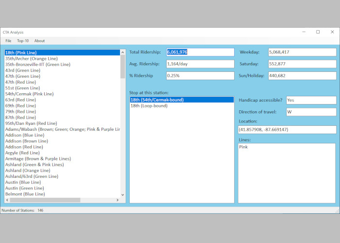

# cta-ridership-analysis
CTA Ridership Analysis

This project analyzes a database of ridership about Chicago’s CTA system. User has database of CTA data, and the user can investigate the stations and stops in the system, as well as ridership data. Also, the user has the ability to display the top-10 stations in terms of ridership.

When the application starts, the UI elements are empty.  
Step #1:  the user selects File >> Load to load the stations in the left-most list box.  
Step #2:  the user selects a station from the list, and the UI elements of #2 are populated — ridership data as well as stops.  
Step #3:  the user selects a stop, and then info about this stop is displayed.  The user also has the ability to display the top-10 stations in terms of ridership — station name and total ridership.

